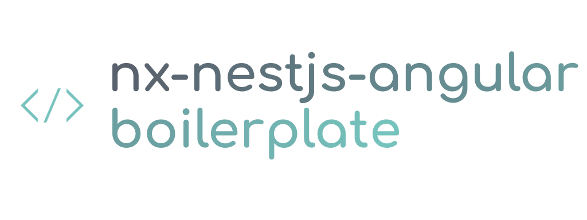

<a name="readme-top"></a>

<br />
<div align="center">
  <a href="https://github.com/wgd3/nx-nestjs-angular-boilerplate">
    
  </a>

<h3 align="center">Nx NestJS Angular Boilerplate</h3>

  <p align="center">
    A boilerplate repository for new projects based on the latest Nx, Angular, and NestJS versions. 
    <br />
    <a href="https://github.com/wgd3/nx-nestjs-angular-boilerplate/docs"><strong>Explore the docs »</strong></a>
    <br />
    <br />
    <a href="https://github.com/wgd3/nx-nestjs-angular-boilerplate/issues">Report Bug</a>
    ·
    <a href="https://github.com/wgd3/nx-nestjs-angular-boilerplate/issues">Request Feature</a>
  </p>
</div>

<!-- TABLE OF CONTENTS -->
<details>
  <summary>Table of Contents</summary>
  <ol>
    <li>
      <a href="#about-the-project">About The Project</a>
      <ul>
        <li><a href="#features">Features</a></li>
        <li><a href="#built-with">Built With</a></li>
      </ul>
    </li>
    <li>
      <a href="#getting-started">Getting Started</a>
      <ul>
        <li><a href="#prerequisites">Prerequisites</a></li>
      </ul>
    </li>
    <li><a href="#roadmap">Roadmap</a></li>
    <li><a href="#contributing">Contributing</a></li>
    <li><a href="#license">License</a></li>
    <li><a href="#contact">Contact</a></li>
    <li><a href="#acknowledgments">Acknowledgments</a></li>
  </ol>
</details>

<!-- ABOUT THE PROJECT -->

## About The Project

After publishing a [series of blog posts](https://thefullstack.engineer) on creating a full-stack project with this same stack, I decided to publish a generic boilerplate for future use. This template has saved me hours of re-implementing the same logic for authentication, user management, Swagger documentation, and more.

<p align="right">(<a href="#readme-top">back to top</a>)</p>

### Features

| Name                 | Status      | Details                                                                                                                                                              |
| -------------------- | ----------- | -------------------------------------------------------------------------------------------------------------------------------------------------------------------- |
| REST API             | Complete    | Powered by NestJS                                                                                                                                                    |
| Frontend             | In Progress | Angular web client                                                                                                                                                   |
| Authentication       | Complete    | JWT support via Passport                                                                                                                                             |
| Authorization        | Complete    | Simple role-based support (admin/user)                                                                                                                               |
| User Registration    | Complete    | Local registration via email/password<br/>Social OAuth support for Google                                                                                            |
| User Management      | Complete    | Email verification<br/>Forget/password reset                                                                                                                         |
| Database Integration | Complete    | TypeORM                                                                                                                                                              |
| Data Validation      | Complete    | Infrastructure: Shared, core libraries maintain data structures between libraries<br>Backend: `class-validator`, Swagger models, database logic, and custom services |
| Configuration        | Complete    | `.env` file handles all base configuration<br>Environment-based configuration can be used for builds and pipelines                                                   |
| CI/CD                | Complete    | Distributed CI runners powered by Nx Cloud handle linting, testing, and builds                                                                                       |
| Error Handling       | Complete    | Integration with Sentry                                                                                                                                              |

<p align="right">(<a href="#readme-top">back to top</a>)</p>

### Built With

- [![NestJS][nestjs.com]][Nestjs-url]
- [![Angular][Angular.io]][Angular-url]
- [![Nx][nx.dev]][nx-url]

<p align="right">(<a href="#readme-top">back to top</a>)</p>

<!-- GETTING STARTED -->

## Getting Started

To create your own repository from this codebase, click the "Use this template" button in the GitHub UI.

### Prerequisites

A few things are needed before working on this project:

- yarn

  ```sh
  > npm install yarn@latest -g

  # alternative installation method

  > brew install yarn
  ```

- nx
  ```sh
  > npm install nx@latest -g
  ```

**Optional** Integrations:

- Sentry DSN
- Google OAuth Client ID/Secret
- SMTP settings

### Getting Started

See [GETTING_STARTED.md](docs/GETTING_STARTED.MD) for steps on configuring your workspace and customizing your application.

<p align="right">(<a href="#readme-top">back to top</a>)</p>

## Roadmap

See [TODO.md](TODO.md) for details on planned features and ideas

See the [open issues](https://github.com/wgd3/nx-nestjs-angular-boilerplate/issues) for a full list of proposed features (and known issues).

<p align="right">(<a href="#readme-top">back to top</a>)</p>

<!-- CONTRIBUTING -->

## Contributing

Contributions are what make the open source community such an amazing place to learn, inspire, and create. Any contributions you make are **greatly appreciated**.

If you have a suggestion that would make this better, please fork the repo and create a pull request. You can also simply open an issue with the tag "enhancement".
Don't forget to give the project a star! Thanks again!

1. Fork the Project
2. Create your Feature Branch (`git checkout -b feature/AmazingFeature`)
3. Commit your Changes (`git commit -m 'Add some AmazingFeature'`)
4. Push to the Branch (`git push origin feature/AmazingFeature`)
5. Open a Pull Request

<p align="right">(<a href="#readme-top">back to top</a>)</p>

<!-- LICENSE -->

## License

Distributed under the MIT License. See `LICENSE` for more information.

<p align="right">(<a href="#readme-top">back to top</a>)</p>

<!-- CONTACT -->

## Contact

Wallace Daniel - [The Full Stack Engineer](https://thefullstack.engineer) - wallace@thefullstack.engineer

Project Link: [https://github.com/wgd3/nx-nestjs-angular-boilerplate](https://github.com/wgd3/nx-nestjs-angular-boilerplate)

<p align="right">(<a href="#readme-top">back to top</a>)</p>

<!-- ACKNOWLEDGMENTS -->

## Acknowledgments

This repository results from my experiments with different repository structures, best practices, and framework integrations. Part of the evolution of this repository included chunks of code copied from, or inspired by, other repositories.

- [nestjs-api-boilerplate-jwt](https://github.com/Tony133/nestjs-api-boilerplate-jwt/tree/main)
- [awesome-nest-boilerplate](https://github.com/NarHakobyan/awesome-nest-boilerplate/tree/main)
- [nestjs-boilerplate](https://github.com/brocoders/nestjs-boilerplate/tree/main)
- [nestjs-starter-rest-api](https://github.com/monstar-lab-oss/nestjs-starter-rest-api/tree/master)
- [domain-driven-hexagon](https://github.com/Sairyss/domain-driven-hexagon)
- [type-safe-full-stack](https://github.com/jczacharia/type-safe-full-stack)

This list continually evolves; more will be added as the repository evolves!

<p align="right">(<a href="#readme-top">back to top</a>)</p>

<!-- MARKDOWN LINKS & IMAGES -->
<!-- https://www.markdownguide.org/basic-syntax/#reference-style-links -->

[contributors-shield]: https://img.shields.io/github/contributors/wgd3/nx-nestjs-angular-boilerplate.svg?style=for-the-badge
[contributors-url]: https://github.com/wgd3/nx-nestjs-angular-boilerplate/graphs/contributors
[forks-shield]: https://img.shields.io/github/forks/wgd3/nx-nestjs-angular-boilerplate.svg?style=for-the-badge
[forks-url]: https://github.com/wgd3/nx-nestjs-angular-boilerplate/network/members
[stars-shield]: https://img.shields.io/github/stars/wgd3/nx-nestjs-angular-boilerplate.svg?style=for-the-badge
[stars-url]: https://github.com/wgd3/nx-nestjs-angular-boilerplate/stargazers
[issues-shield]: https://img.shields.io/github/issues/wgd3/nx-nestjs-angular-boilerplate.svg?style=for-the-badge
[issues-url]: https://github.com/wgd3/nx-nestjs-angular-boilerplate/issues
[license-shield]: https://img.shields.io/github/license/wgd3/nx-nestjs-angular-boilerplate.svg?style=for-the-badge
[license-url]: https://github.com/wgd3/nx-nestjs-angular-boilerplate/blob/master/LICENSE.txt
[linkedin-shield]: https://img.shields.io/badge/-LinkedIn-black.svg?style=for-the-badge&logo=linkedin&colorB=555
[linkedin-url]: https://linkedin.com/in/linkedin_username
[product-screenshot]: images/screenshot.png
[Angular.io]: https://img.shields.io/badge/Angular-DD0031?style=for-the-badge&logo=angular&logoColor=white
[Angular-url]: https://angular.io/
[Nestjs-url]: https://docs.nestjs.com
[Nestjs.com]: https://img.shields.io/badge/nestjs-0769AD?style=for-the-badge&logo=nestjs&logoColor=red
[nx.dev]: https://img.shields.io/badge/nx-0769AD?style=for-the-badge&logo=nx&logoColor=blue
[nx-url]: https://nx.dev
